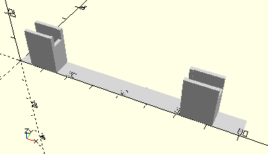

# FrameBracketWithAxle80
Getriebehalter mit Welle 180.
- 38201



## Use
```
use <../Elements/FrameBracketWithAxle80.scad>
```

## Syntax
```
FrameBracketWithAxle80();

space = getFrameBracketWithAxle80Space();
```

## Rückgabewert getFrameBracketWithAxle80Space
Fläche als \[x,y]-Liste