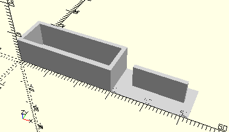

# FrameBracketWithWorm
Lager mit Schnecke für den 6V-Motor.
- 31045



## Use
```
use <../Elements/FrameBracketWithWorm.scad>
```

## Syntax
```
FrameBracketWithWorm();

space = getFrameBracketWithWormSpace();
```

## Rückgabewert getFrameBracketWithWormSpace
Fläche als \[x,y]-Liste