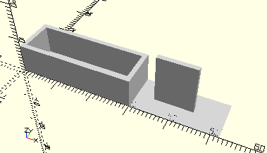

# FrameBracketWithoutWorm
Lager ohne Schnecke für den 6V-Motor.
- 31046



## Use
```
use <../Elements/FrameBracketWithoutWorm.scad>
```

## Syntax
```
FrameBracketWithoutWorm();

space = getFrameBracketWithoutWormSpace();
```

## Rückgabewert getFrameBracketWithoutWormSpace
Fläche als \[x,y]-Liste