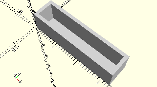

# FrameBuildingPlate5x15x30
Bauplatte 5x15x30.
- 32330

Mit *count* kann die Anzahl der baulplatten angegeben werden.



## Use
```
use <../Elements/FrameBuildingPlate5x15x30.scad>
```

## Syntax
```
FrameBuildingPlate5x15x30(
    count=1);

space = getFrameBuildingPlate5x15x30Space(
    count=1);
    count=1);
```

| Parameter | Typ | Beschreibung |
| ------ | ------ | ------ |
| count | Integer | Anzahl der Bauplatten, die im Rahmen nebeneinander latz haben sollen. |

## Rückgabewert getFrameBuildingPlate5x15x30Space
Fläche als \[x,y]-Liste