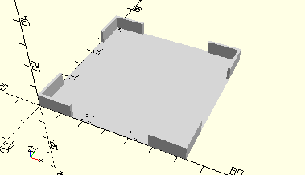
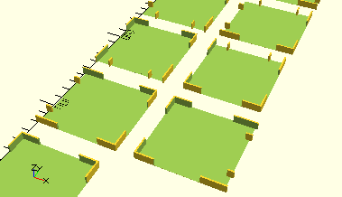

# FrameCassette
Kassette mit oder ohne Klarsichtdeckel.
- 36518



## Use
```
use <../Elements/FrameCassette.scad>
include <../Base/PlacementOptions.scad>
```

## Syntax
```
FrameCassette(
    alignX=NoAlign,
    alignY=NoAlign);

space = getFrameCassetteSpace(
    alignX=NoAlign,
    alignY=NoAlign);
```

| Parameter | Typ | Beschreibung |
| ------ | ------ | ------ |
| alignX | Integer (Enum) | Erzeugt optional einen Rand für das Andocken an die linke oder rechte Wand des Sortierkastens: 0=NoAlign 1=AlignLeft 4=AlignRight. Es werden Stege erzeugt, die mit der Wand verschmelzen. |
| alignY | Integer (Enum) | Erzeugt optional einen Rand für das Andocken an die hintere oder vordere Wand des Sortierkastens: 0=NoAlign 2=AlignBottom 5=AlignTop. Es werden Stege erzeugt, die mit der Wand verschmelzen. |

## Rückgabewert getFrameCassetteSpace
Fläche als \[x,y]-Liste

## Beispiel
Test/Elements/TestFrameCassete.scad

```
use <../../Base/Placement.scad>
use <../../Elements/FrameCassette.scad>

include <../../Base/PlacementOptions.scad>

FrameCassette();

Place(0, 80)
    FrameCassette(alignX=AlignLeft);

Place(80, 80)
    FrameCassette(alignX=AlignRight);

Place(0, 160)
    FrameCassette(alignY=AlignBottom);

Place(80, 160)
    FrameCassette(alignY=AlignTop);

Place(0, 240)
    FrameCassette(alignX=AlignLeft, alignY=AlignBottom);

Place(80, 240)
    FrameCassette(alignX=AlignLeft, alignY=AlignTop);

Place(0, 320)
    FrameCassette(alignX=AlignRight, alignY=AlignBottom);

Place(80, 320)
    FrameCassette(alignX=AlignRight, alignY=AlignTop);
```

