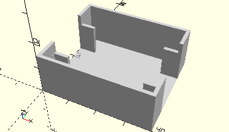

# FrameConcaveMirror
Hohlspiegel.
- 31369



3D-Druck getestet

## Use
```
use <../Elements/FrameConcaveMirror.scad>
```

## Syntax
```
FrameConcaveMirror();

space = getFrameConcaveMirrorSpace();
```

## Rückgabewert getFrameConcaveMirrorSpace
Fläche als \[x,y]-Liste