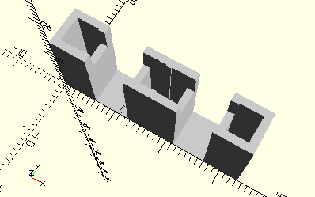

# FrameConnectingRod30
Schubstange 30 für Hubgetriebe.
- 37276



## Use
```
use <../Elements/FrameConnectingRod30.scad>
```

## Syntax
```
FrameConnectingRod30();

space = getFrameConnectingRod30Space();
```

## Rückgabewert getFrameConnectingRod30Space
Fläche als \[x,y]-Liste