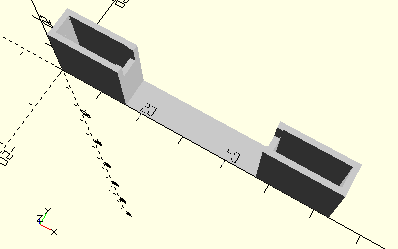

# FrameConnectingRod60
Schubstange 60 für Hubgetriebe.
- 37283



## Use
```
use <../Elements/FrameConnectingRod60.scad>
```

## Syntax
```
FrameConnectingRod60();

space = getFrameConnectingRod60Space();
```

## Rückgabewert getFrameConnectingRod60Space
Fläche als \[x,y]-Liste