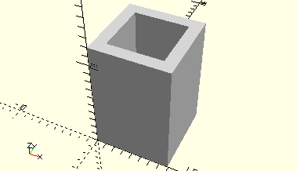

# FrameControlLight
Elektronikbaustein Stecklampe 6V.
- 36390



3D-Druck getestet

## Use
```
use <../Elements/FrameControlLight.scad>
```

## Syntax
```
FrameControlLight();

space = getFrameControlLightSpace();
```

## Rückgabewert getFrameControlLightSpace
Fläche als \[x,y]-Liste