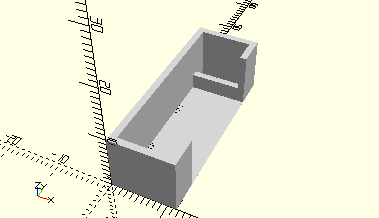

# FrameCouplingBracket
Lagerbock.
- 38252



## Use
```
use <../Elements/FrameCouplingBracket.scad>
```

## Syntax
```
FrameCouplingBracket();

space = getFrameCouplingBracketSpace();
```

## Rückgabewert getFrameCouplingBracketSpace
Fläche als \[x,y]-Liste