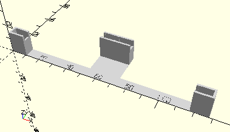

# FrameCrankedAxis
Kurbelwelle.
- 31080



## Use
```
use <../Elements/FrameCrankedAxis.scad>
```

## Syntax
```
FrameCrankedAxis();

space = getFrameCrankedAxisSpace();
```

## Rückgabewert getFrameCrankedAxisSpace
Fläche als \[x,y]-Liste. Diese Fläche ist das gesamte Rechteck, auch wenn die linke und rechte obere Ecke nicht von der Achse belegt sind.