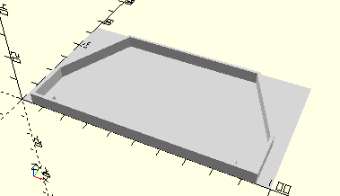

# FrameDriversCabLeftRight
Linker und rechter Teil Führerhaus.
- 38435
- 38436



## Use
```
use <../Elements/FrameDriversCabLeftRight.scad>
```

## Syntax
```
FrameDriversCabLeftRight();

space = getFrameDriversCabLeftRightSpace();
```

## Rückgabewert getFrameDriversCabLeftRightSpace
Fläche als \[x,y]-Liste