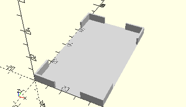
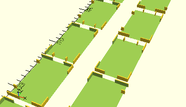

# FrameElectronicBlock
Elektronikbaustein (Silberling).
- 36391
- 36392
- 36393
- 36394
- 36479
- 36480
- 36481
- 36482
- 36483
- 36713
- 36733
- 36735
- 36786
- 37140 (alt, hobbylabor1)
- 37683



## Use
```
use <../Elements/FrameElectronicBlock.scad>
```

## Syntax
```
FrameElectronicBlock(
    alignX=NoAlign,
    alingY=NoAlign);

space = getFrameElectronicBlockSpace(
    alignX=NoAlign,
    alingY=NoAlign);
```

| Parameter | Typ | Beschreibung |
| ------ | ------ | ------ |
| alignX | Integer (Enum) | Erzeugt optional einen Rand für das Andocken an die linke oder rechte Wand des Sortierkastens: 0=NoAlign 1=AlignLeft 4=AlignRight. Es werden Stege erzeugt, die mit der Wand verschmelzen. |
| alignY | Integer (Enum) | Erzeugt optional einen Rand für das Andocken an die hintere oder vordere Wand des Sortierkastens: 0=NoAlign 2=AlignBottom 5=AlignTop. Es werden Stege erzeugt, die mit der Wand verschmelzen. |

## Rückgabewert getFrameElectronicBlockSpace
Fläche als \[x,y]-Liste.

## Beispiel
Test/Elements/TestFrameElectronicBlock.scad

```
use <../../Base/Placement.scad>
use <../../Elements/FrameElectronicBlock.scad>

include <../../Base/PlacementOptions.scad>

FrameElectronicBlock();

Place(0, 85)
    FrameElectronicBlock(alignX=AlignLeft);

Place(80, 85)
    FrameElectronicBlock(alignX=AlignRight);

Place(0, 170)
    FrameElectronicBlock(alignY=AlignBottom);

Place(80, 170)
    FrameElectronicBlock(alignY=AlignTop);

Place(0, 260)
    FrameElectronicBlock(alignX=AlignLeft, alignY=AlignBottom);

Place(80, 260)
    FrameElectronicBlock(alignX=AlignLeft, alignY=AlignTop);

Place(0, 350)
    FrameElectronicBlock(alignX=AlignRight, alignY=AlignBottom);

Place(80, 350)
    FrameElectronicBlock(alignX=AlignRight, alignY=AlignTop);
```

