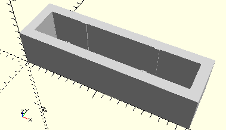

# FrameElectronicBlockConnector
Verbindungsstecker für Elektronik-Bausteine.
- 36380



## Use
```
use <../Elements/FrameElectronicBlockConnector.scad>
```

## Syntax
```
FrameElectronicBlockConnector();

space = getFrameElectronicBlockConnectorSpace();
```

## Rückgabewert getFrameElectronicBlockConnectorSpace
Fläche als \[x,y]-Liste