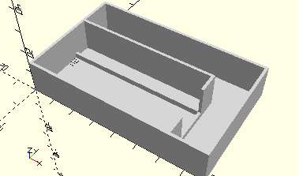
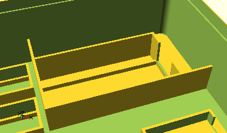

# FrameElectronicsController
E-Tec-, Electronics Modul oder Robotics Modul mit Fach für montiertes Kabel.
- 32263
- 152063
- 156499

Das Element kann an Wände oder in Ecken des Sortierkastens angedockt werden.



## Use
```
use <../Elements/FrameElectronicsController.scad>

include <../../Base/PlacementOptions.scad>
```

## Syntax
```
FrameElectronicsController(
    alignX);

space = get$FrameElectronicsControllerSpace(
    alignX);
```

| Parameter | Typ | Beschreibung |
| ------ | ------ | ------ |
| alignX | typ | beschreibung |

## Rückgabewert getFrameElectronicsControllerSpace
Fläche als \[x,y]-Liste

## Beispiel
```
use <../../Base/Placement.scad>
use <../../Base/Boxes.scad>
use <../../Elements/FrameElectronicsController.scad>

include <../../Base/PlacementOptions.scad>

Box190();

Place(alignX=AlignRight, alignY=AlignTop, elementSpace=getFrameElectronicsControllerSpace())
    FrameElectronicsController(alignX=AlignRight, alignY=AlignTop);
```

