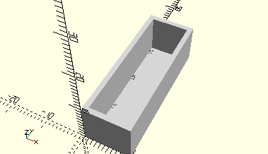

# FrameFlatPiece30
Flachstück 30.
- 31013



## Use
```
use <../Elements/FrameFlatPiece30.scad>
```

## Syntax
```
FrameFlatPiece30(
    count=1);

space = getFrameFlatPiece30Space(
    count=1);
```

| Parameter | Typ | Beschreibung |
| ------ | ------ | ------ |
| count | Integer | Anzahl der Flachstücke, die hintereinander in den Rahmen gestellt werden können. |

## Rückgabewert getFrameFlatPiece30Space
Fläche als \[x,y]-Liste