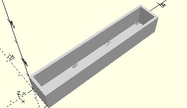

# FrameFlatPiece60
Flachstück 60.
- 31555



## Use
```
use <../Elements/FrameFlatPiece60.scad>
```

## Syntax
```
FrameFlatPiece60(
    count=1);

space = getFrameFlatPiece60Space(
    count=1);
```

| Parameter | Typ | Beschreibung |
| ------ | ------ | ------ |
| count | Integer | Anzahl der Flachstücke, die hintereinander in den Rahmen gestellt werden. |

## Rückgabewert getFrameFlatPiece60Space
Fläche als \[x,y]-Liste