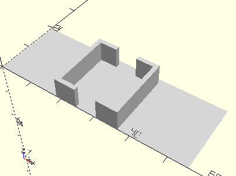

# FrameGearBlock
Getriebeblock für den Mini-Motor (wie mini-mot 1).
- 31067



## Use
```
use <../Elements/FrameGearBlock.scad>
```

## Syntax
```
FrameGearBlock();

space = getFrameGearBlockSpace();
```

## Rückgabewert getFrameGearBlockSpace
Fläche als \[x,y]-Liste