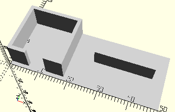

# FrameGearBlockWithWorm
Getriebeblock mit Schnecke m 1,5 für Mini-Motor (wie in mini-mot 1).
- 31066
- 31075



## Use
```
use <../Elements/FrameGearBlockWithWorm.scad>
```

## Syntax
```
FrameGearBlockWithWorm();

space = getFrameGearBlockWithWormSpace();
```

## Rückgabewert getFrameGearBlockWithWormSpace
Fläche als \[x,y]-Liste