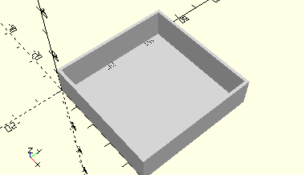

# FrameGearBox
Stufengetriebe für 6V-Motor.
- 31048



## Use
```
use <../Elements/FrameGearBox.scad>
```

## Syntax
```
FrameGearBox();

space = getFrameGearBoxSpace();
```

## Rückgabewert getFrameGearBoxSpace
Fläche als \[x,y]-Liste