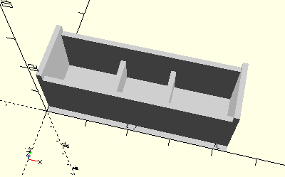

# FrameGearRack30
Hubzahnstange 30.
- 37457



## Use
```
use <../Elements/FrameGearRack30.scad>
```

## Syntax
```
FrameGearRack30(
    dock=false);

space = getFrameGearRack30Space(
    dock=false);
```

| Parameter | Typ | Beschreibung |
| ------ | ------ | ------ |
| dock | Boolean | __true__ wenn die linke Seite des Rahmens an die Wand gedockt werden soll. Der Rahmen ist dann nach links offen und der X-Nullpunkt ist um die Wandstärke nach rechts verschoben. Die Länge der Fläche ist um einen Wandbreite reduziert. |

## Rückgabewert getFrameGearRack30Space
Fläche als \[x,y]-Liste