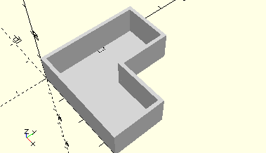

# FrameJointBlock
Gelenkstein oder Federgelenkstein.
- 31008
- 31009
- 31308
- 35831
- 36223
- 172804
- 172805



Die Gelenksteiern sind aus mehreren Einzelteilen zusammengesetzt. Die Artikelnummern dieser Einzelteile sind oben aufgeführt.

## Use
```
use <../Elements/FrameJointBlock.scad>
```

## Syntax
```
FrameJointBlock();

space = getFrameJointBlockSpace();
```

## Rückgabewert getFrameJointBlockSpace
Fläche als \[x,y]-Liste. Gerechnet wird die quadratische Fläche inkl. der freien Ecke.