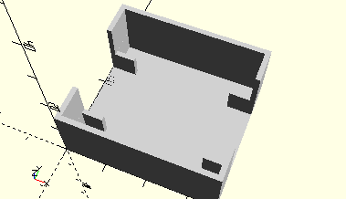

# FrameLens
Sammellinse f=3,5 cm, f=7,0 cm oder f=14,0 cm.
- 31365
- 31366
- 31367



## Use
```
use <../Elements/FrameLens.scad>
```

## Syntax
```
FrameLens();

space = getFrameLensSpace();
```

## Rückgabewert getFrameLensSpace
Fläche als \[x,y]-Liste