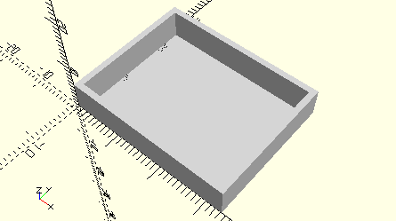

# FrameLiftingGear
Hubgetriebe oder Hubgetrieberahmen ohne Zahnräder.
- 37263
- 37268
- 37272
- 75067



## Use
```
use <../Elements/FrameLiftingGear.scad>
```

## Syntax
```
FrameLiftingGear();

space = getFrameLiftingGearSpace();
```

## Rückgabewert getFrameLiftingGearSpace
Fläche als \[x,y]-Liste