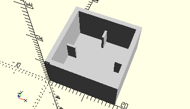

# FrameLightCap
Leucht- und Störlichtkappen.
- 31316
- 31317
- 31318
- 31319
- 31320
- 31321
- 31362
- 36478
- 36531
- 36532



## Use
```
use <../Elements/FrameLightCap.scad>
```

## Syntax
```
FrameLightCap();

space = getFrameLightCapSpace();
```

## Rückgabewert getFrameLightCapSpace
Fläche als \[x,y]-Liste