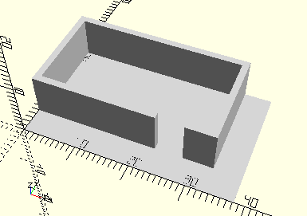

# FrameLightTube
Störlichttubus.
- 31363



Der Tubus wird mit geöffneter Klappe auf die Seite in den Rahmen gelegt. Die Fläche ist dementsprechend vergrößert, damit die Klappe außerhalb des Rahmens Platz hat.

## Use
```
use <../Elements/FrameLightTube.scad>
```

## Syntax
```
FrameLightTube();

space = getFrameLightTubeSpace();
```

## Rückgabewert getFrameLightTubeSpace
Fläche als \[x,y]-Liste. Der Platz für die aufgeklappte Klappe wird mit jeweils 5 mm  berücksichtigt.