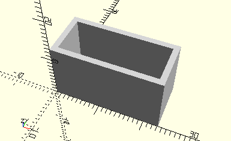

# FrameLockingRing
Klemmring für Seiltrommel.
- 31020



## Use
```
use <../Elements/FrameLockingRing.scad>
```

## Syntax
```
FrameLockingRing();

space = getFrameLockingRingSpace();
```

## Rückgabewert getFrameLockingRingSpace
Fläche als \[x,y]-Liste