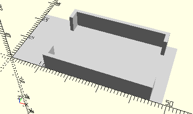

# FrameMiniMotor
Mini-Motor 6V oder XS-Motor 9V.
- 31062
- 137096



3D-Druck getestet.

## Use
```
use <../Elements/FrameMiniMotor.scad>
```

## Syntax
```
FrameMiniMotor();

space = getFrameMiniMotorSpace();
```

## Rückgabewert getFrameMiniMotorSpace
Fläche als \[x,y]-Liste