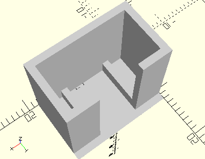

# FrameMiniPushButton
Minitaster.
- 37780
- 37783



## Use
```
use <../Elements/FrameMiniPushButton.scad>
```

## Syntax
```
FrameMiniPushButton();

space = getFrameMiniPushButtonSpace();
```

## Rückgabewert getFrameMiniPushButtonSpace
Fläche als \[x,y]-Liste