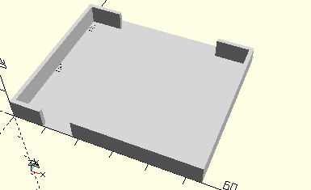

# FrameMotor6V
Gleichstrommotor 6V.
- 31039



Die Aussparung unten ist für die untere Steckbuche, so dass das Kabel auch im Sortierkasten gesteckt bleiben kann. Das Element ist identisch mit mot1.

## Use
```
use <../Elements/FrameMotor6V.scad>
```

## Syntax
```
FrameMotor6V();

space = getFrameMotor6VSpace();
```

## Rückgabewert getFrameMotor6VSpace
Fläche als \[x,y]-Liste