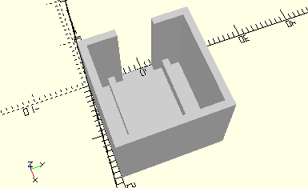

# FramePhotoResistor30
Fotowiderstand 30.
- 31361



Der Widerstand wird aufrecht in den Rahmen gestellt.

## Use
```
use <../Elements/FramePhotoResistor30.scad>
```

## Syntax
```
FramePhotoResistor30();

space = getFramePhotoResistor30Space();
```

## Rückgabewert getFramePhotoResistor30Space
Fläche als \[x,y]-Liste