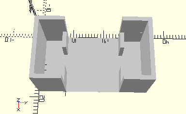

# FramePlaneMirror
Planspiegel 15 x 30.
- 31368



## Use
```
use <../Elements/FramePlaneMirror.scad>
```

## Syntax
```
FramePlaneMirror();

space = getFramePlaneMirrorSpace();
```

## Rückgabewert getFramePlaneMirrorSpace
Fläche als \[x,y]-Liste