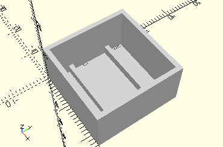

# FramePlasticBall20
Plastikkugel 20mm wie in ROBOTICS SmartTech.
- 185695



## Use
```
use <../Elements/FramePlasticBall20.scad>
```

## Syntax
```
FramePlasticBall20(
    count=1);

space = get$FramePlasticBall20Space(
    count=1);
```

| Parameter | Typ | Beschreibung |
| ------ | ------ | ------ |
| count | Integer | Zahl der Kugeln nebeneinander. |

## Rückgabewert getFramePlasticBall20Space
Fläche als \[x,y]-Liste