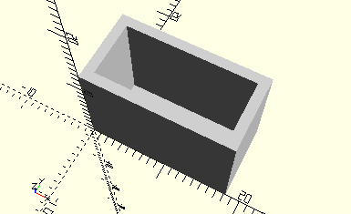

# FramePluggedCapacitor
Kondensator 100 nF mit 2 Steckern.
- 36387



Es werden die beiden Stecker in den Rahmen gesteckt. Vergleiche ec2.

## Use
```
use <../Elements/FramePluggedCapacitor.scad>
```

## Syntax
```
FramePluggedCapacitor();

space = getFramePluggedCapacitorSpace();
```

## Rückgabewert getFramePluggedCapacitorSpace
Fläche als \[x,y]-Liste