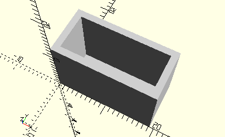

# FramePluggedResistor
Widerstand 22 kOhm mit 2 Steckern.
- 36381



Es werden die beiden Stecker in den Rahmen gesteckt. Vergeliche ec2.

## Use
```
use <../Elements/FramePluggedResistor.scad>
```

## Syntax
```
FramePluggedResistor();

space = getFramePluggedResistorSpace();
```

## Rückgabewert getFramePluggedResistorSpace
Fläche als \[x,y]-Liste