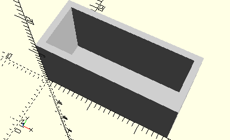

# FramePulley
Seilrolle 21.
- 35795
- 35797



## Use
```
use <../Elements/FramePulley.scad>
```

## Syntax
```
FramePulley();

space = getFramePulleySpace();
```

## Rückgabewert getFramePulleySpace
Fläche als \[x,y]-Liste