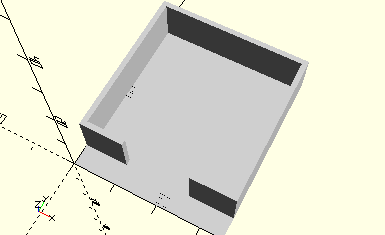

# FramePushButton
Taster oder Polwendeschalter.
- 31331
- 31332



## Use
```
use <../Elements/FramePushButton.scad>
```

## Syntax
```
FramePushButton();

space = getFramePushButtonSpace();
```

## Rückgabewert getFramePushButtonSpace
Fläche als \[x,y]-Liste