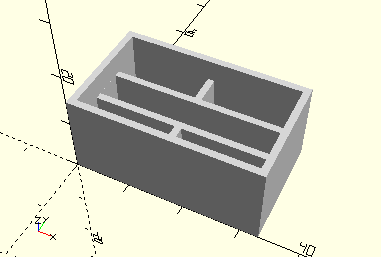

# FrameRack30
Zahnstange 30 m1,5.
- 31054



## Use
```
use <../Elements/FrameRack30.scad>
```

## Syntax
```
FrameRack30(
    count=1);

space = getFrameRack30Space(
    count=1);
```

| Parameter | Typ | Beschreibung |
| ------ | ------ | ------ |
| count | Integer | Anzahl der Zahnstangen in Reihe. Üblich sind 1 oder 2. |

## Rückgabewert getFrameRack30Space
Fläche als \[x,y]-Liste