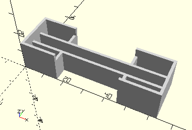

# FrameRack60
Zahnstange 60 m1,5.
- 31053



## Use
```
use <../Elements/FrameRack60.scad>
```

## Syntax
```
FrameRack60(
    count=1);

space = getFrameRack60Space(
    count=1);
```

| Parameter | Typ | Beschreibung |
| ------ | ------ | ------ |
| count | Integer | Anzahl der Zahnstangen 60 nebeneinander. Es werden 60 mm lange Rahmen längs hinzugefügt. Die Zahnstangen werden nicht durch eine Wand getrennt, sondern schließen direkt aneinder an. |

## Rückgabewert getFrameRack60Space
Fläche als \[x,y]-Liste

## Beispiel
Bei count = 2:

