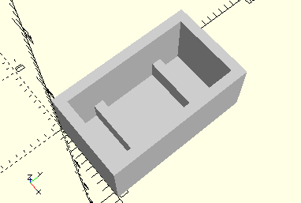

# FrameReedRelayHolder
Reed-Kontakt Halter.
- 35969



## Use
```
use <../Elements/FrameReedRelayHolder.scad>
```

## Syntax
```
FrameReedRelayHolder();

space = getFrameReedRelayHolderSpace();
```

## Rückgabewert getFrameReedRelayHolderSpace
Fläche als \[x,y]-Liste