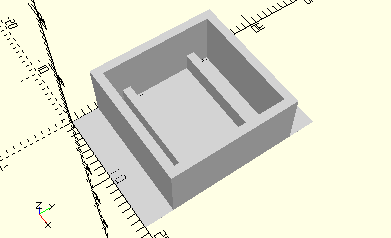

# FrameRollerBuck
Rollenbock.
- 32085



3D-Druck getestet.

## Use
```
use <../Elements/FrameRollerBuck.scad>
```

## Syntax
```
FrameRollerBuck(
    count=1);

space = get$FrameRollerBuckSpace(
    count=1);
```

| Parameter | Typ | Beschreibung |
| ------ | ------ | ------ |
| count | Integer | Anzahl der Rollenböcke |

## Rückgabewert getFrameRollerBuckSpace
Fläche als \[x,y]-Liste