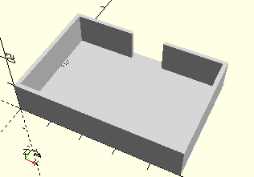

# FrameSensor45x30
Computing Umwelt- oder Gestensensor mit 45x30x15 mm.
- 167358
- 186705



## Use
```
use <../Elements/FrameSensor45x30.scad>
```

## Syntax
```
FrameSensor45x30();

space = getFrameSensor45x30Space();
```

## Rückgabewert getFrameSensor45x30Space
Fläche als \[x,y]-Liste