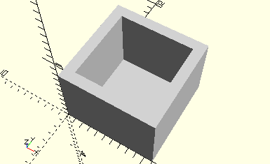

# FrameShortHook
Seilhaken kurz.
- 38224
- 38225



## Use
```
use <../Elements/FrameShortHook.scad>
```

## Syntax
```
FrameShortHook();

space = getFrameShortHookSpace();
```

## Rückgabewert getFrameShortHookSpace
Fläche als \[x,y]-Liste