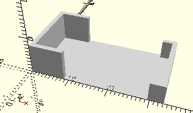

# FrameSidePiece15
Verlängerung Seitenteil 15 mm.
- 163200



## Use
```
use <../Elements/FrameSidePiece15.scad>
```

## Syntax
```
FrameSidePiece15(
    count=1);

space = get$FrameSidePiece15Space(
    count=1);
```

| Parameter | Typ | Beschreibung |
| ------ | ------ | ------ |
| count | Integer | Anzahl der nebeneinander liegenden Seitenteile. |

## Rückgabewert getFrameSidePiece15Space
Fläche als \[x,y]-Liste