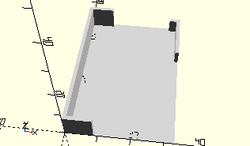

# FrameSidePieceLeft
Linkes Seitenteil.
- 163198



## Use
```
use <../Elements/FrameSidePieceLeft.scad>
```

## Syntax
```
FrameSidePieceLeft();

space = getFrameSidePieceLeftSpace();
```

## Rückgabewert getFrameSidePieceLeftSpace
Fläche als \[x,y]-Liste