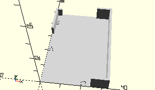

# FrameSidePieceRight
Rechtes Seitenteil.
- 163199



## Use
```
use <../Elements/FrameSidePieceRight.scad>
```

## Syntax
```
FrameSidePieceRight();

space = getFrameSidePieceRightSpace();
```

## Rückgabewert getFrameSidePieceRightSpace
Fläche als \[x,y]-Liste