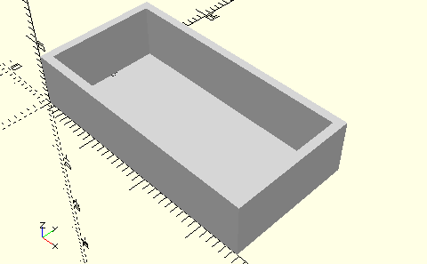

# FrameSingleLayingStandardBlock
Ligender Standardbaustein 30 (mit Bohrung).
- 31004
- 32880



In mot3 sind die beiden Bausteine 30 mit Bohrung liegend in Rahmen gelagert. Die Rahmen berücksichtigen den Zapfen.

3D-Druck getestet

## Use
```
use <../Elements/FrameSingleLayingStandardBlock.scad>
```

## Syntax
```
FrameSingleLayingStandardBlock();

space = getFrameSingleLayingStandardBlockSpace();
```

## Rückgabewert getFrameSingleLayingStandardBlockSpace
Fläche als \[x,y]-Liste