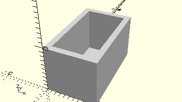

# FrameSmallBlock
Baustein 5 oder 7,5.
- 37237
- 37238



## Use
```
use <../Elements/FrameSmallBlock.scad>
```

## Syntax
```
FrameSmallBlock(    
    columns=1,
    rows=1);

space = getFrameSmallBlockSpace(
    columns=1,
    rows=1);
```

| Parameter | Typ | Beschreibung |
| ------ | ------ | ------ |
| columns | Integer | Anzahl der Bausteine in X-Richtung aneinander (lange Seite) |
| rows | Integer | Anzahl der Bausteine in Y-Richtung nebeneinander (kurze Seite)  |

## Rückgabewert getFrameSmallBlockSpace
Fläche als \[x,y]-Liste