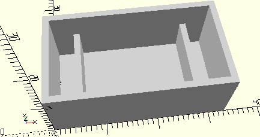

# FrameSwivelBaseForMiniMotor
Drehschieber für Mini-Motor.
- 31070



## Use
```
use <../Elements/FrameSwivelBaseForMiniMotor.scad>
```

## Syntax
```
FrameSwivelBaseForMiniMotor();

space = getFrameSwivelBaseForMiniMotorSpace();
```

## Rückgabewert getFrameSwivelBaseForMiniMotorSpace
Fläche als \[x,y]-Liste