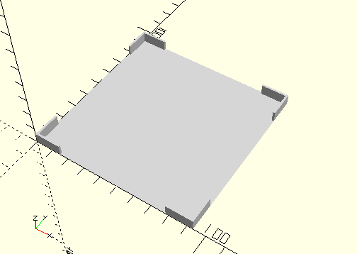
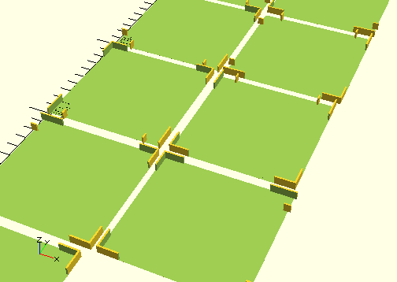

# FrameTXTController
TX/TXT Controller.
- 153513
- 173067
- 500995



## Use
```
use <../Elements/FrameTXTController.scad>
```

## Syntax
```
FrameTXTController(
    alignX=NoAlign,
    alingY=NoAlign);

space = getFrameTXTControllerSpace(
    alignX=NoAlign,
    alingY=NoAlign);
```

| Parameter | Typ | Beschreibung |
| ------ | ------ | ------ |
| alignX | Integer (Enum) | Erzeugt optional einen Rand für das Andocken an die linke oder rechte Wand des Sortierkastens: 0=NoAlign 1=AlignLeft 4=AlignRight. Es werden Stege erzeugt, die mit der Wand verschmelzen. |
| alignY | Integer (Enum) | Erzeugt optional einen Rand für das Andocken an die hintere oder vordere Wand des Sortierkastens: 0=NoAlign 2=AlignBottom 5=AlignTop. Es werden Stege erzeugt, die mit der Wand verschmelzen. |

## Rückgabewert getFrameTXTControllerSpace
Fläche als \[x,y]-Liste.

## Beispiel
Test/Elements/TestFrameTXTController.scad

```
use <../../Base/Placement.scad>
use <../../Elements/FrameTXTController.scad>

include <../../Base/PlacementOptions.scad>

FrameTXTController();

Place(0, 100)
    FrameTXTController(alignX=AlignLeft);

Place(100, 100)
    FrameTXTController(alignX=AlignRight);

Place(0, 200)
    FrameTXTController(alignY=AlignBottom);

Place(100, 200)
    FrameTXTController(alignY=AlignTop);

Place(0, 300)
    FrameTXTController(alignX=AlignLeft, alignY=AlignBottom);

Place(100, 300)
    FrameTXTController(alignX=AlignLeft, alignY=AlignTop);

Place(0, 400)
    FrameTXTController(alignX=AlignRight, alignY=AlignBottom);

Place(100, 400)
    FrameTXTController(alignX=AlignRight, alignY=AlignTop);
```

